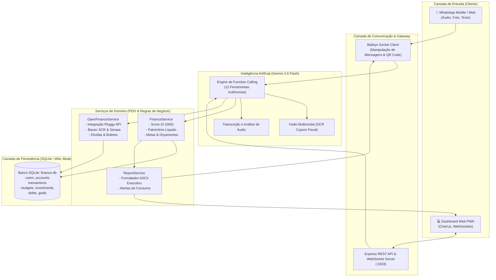

# 🏦 Open Finance IA — Consultor Financeiro Pessoal no WhatsApp & Web


Assistente financeiro pessoal de nível executivo integrado ao **WhatsApp** e compatível com as diretrizes do **Open Finance Brasil (Banco Central)**. Utiliza Inteligência Artificial Multimodal com **Google Gemini 3.6 Flash** (Function Calling), transcrição de áudio de voz, reconhecimento OCR de comprovantes, sincronização bancária (Pluggy API), monitoramento de dívidas (Bacen SCR / Serasa) e painel web responsivo em tempo real.

---

## 🗺️ 1. Arquitetura do Sistema & Fluxo de Dados

O diagrama abaixo ilustra o fluxo ponta a ponta desde a entrada do usuário (WhatsApp ou Dashboard Web) até o processamento da IA com Tool Calling e persistência:



---

## 🗄️ 2. Diagrama Entidade-Relacionamento (Banco de Dados)

O modelo relacional foi projetado seguindo as normas do Open Finance Brasil para acomodar ativos, passivos e histórico de transações:

```mermaid
erDiagram
    USERS ||--o{ ACCOUNTS : possui
    USERS ||--o{ TRANSACTIONS : realiza
    USERS ||--o{ BUDGETS : define
    USERS ||--o{ INVESTMENTS : mantem
    USERS ||--o{ FINANCIAL_GOALS : persegue
    USERS ||--o{ DEBTS : responde_por
    USERS ||--o{ CHAT_HISTORY : conversa

    USERS {
        string phone PK "Telefone E.164 (ex: 5511945868954)"
        string name "Nome do usuário"
        datetime created_at "Data de adesão"
    }

    ACCOUNTS {
        int id PK
        string user_phone FK
        string institution "Nubank, Itaú, etc."
        string account_type "checking | savings | credit_card | investment"
        string name "Identificador da conta"
        real balance "Saldo atual"
        real credit_limit "Limite de crédito"
        int is_active "1 para ativa"
    }

    TRANSACTIONS {
        int id PK
        string user_phone FK
        string type "income | expense | transfer"
        real amount "Valor da operação"
        string category "Alimentação, Transporte, etc."
        string description "Descrição da despesa"
        string payment_method "pix | cartao_credito | boleto"
        string date "YYYY-MM-DD"
        string raw_input "Entrada original (voz/texto)"
    }

    BUDGETS {
        int id PK
        string user_phone FK
        string category "Categoria orçada"
        real amount_limit "Teto mensal estipulado"
        string period "YYYY-MM"
    }

    INVESTMENTS {
        int id PK
        string user_phone FK
        string name "CDB, Tesouro, Ações"
        string type "Renda Fixa, Variável"
        real amount_invested "Custo de aquisição"
        real current_value "Marcação a mercado"
    }

    DEBTS {
        int id PK
        string user_phone FK
        string name "Contrato / Empréstimo / Financiamento"
        string institution "Bacen SCR / Serasa / Credor"
        real total_amount "Valor total contratado"
        real remaining_amount "Saldo devedor restante"
        real monthly_payment "Valor da parcela"
        real interest_rate "Taxa de juros anual/mensal"
        string due_date "Data de vencimento"
        int is_active "1 se pendente"
    }

    FINANCIAL_GOALS {
        int id PK
        string user_phone FK
        string name "Reserva de Emergência, etc."
        real target_amount "Montante alvo"
        real current_amount "Montante acumulado"
        string deadline "Data limite"
        int priority "1=Alta, 2=Média, 3=Baixa"
    }

    CHAT_HISTORY {
        int id PK
        string user_phone FK
        string role "user | model"
        string content "Texto da mensagem"
    }
```



---

## 🏛️ 3. Boas Práticas de POO e Clean Code Aplicadas

Este projeto foi construído para demonstrar **Engenharia de Software de nível sênior**:

1. **Princípio da Responsabilidade Única (SRP)**:
   - `FinanceService`: Responsável exclusivamente pelas regras de negócio financeiras, cálculos de Score e consolidação de balanços.
   - `OpenFinanceService`: Isola a integração com APIs bancárias de terceiros (Pluggy, Bacen, Serasa).
   - `ReportService`: Classe utilitária com métodos puros para formatação visual limpa e compatível com clientes móveis.
   - `GeminiService`: Encapsula a orquestração de LLM e invocação de chamadas de funções (*Tool Calling*).

2. **Tipagem Estrita (TypeScript Strict Mode)**:
   - Interfaces detalhadas para todas as entidades de negócio (`Transaction`, `Debt`, `NetWorth`, `FinancialScore`, `Budget`, `Investment`).
   - Zero dependência de tipagens genéricas soltas (`any`) nos contratos principais.

3. **Performance e Resiliência**:
   - SQLite configurado com **PRAGMA WAL Mode** (Write-Ahead Logging) e índices compostos (`idx_tx_phone_date`, `idx_goals_phone`) para leituras concorrentes ultrarrápidas.
   - Tratamento de reconexão automática com backoff exponencial no socket do WhatsApp.
   - Sanitização de caracteres para prevenir falhas de renderização em aparelhos Android/iOS legados.

---

## ✨ Principais Destaques & Funcionalidades

### 📈 1. Algoritmo de Score Open Finance (0–1000)
- Cálculo da pontuação financeira com base em 5 pilares do Banco Central: Taxa de Poupança (25%), Aderência ao Orçamento (25%), Metas (20%), Endividamento (20%) e Consistência (10%).

### 🎙️ 2. Interação Multimodal por Voz e Foto (WhatsApp)
- **Mensagens de Áudio**: Fale naturalmente (*"Gastei R$ 45 no almoço no débito"* ou *"Recebi R$ 1.500 no Pix"*) e a IA transcreve, interpreta a intenção e registra automaticamente.
- **Cupons e Comprovantes (OCR)**: Tire foto da nota fiscal; a visão computacional do Gemini extrai valor, estabelecimento, data e categoria.

### 🏦 3. Dívidas & Boletos (Bacen SCR / Serasa / Open Finance)
- Monitoramento de saldo devedor consolidado de empréstimos, financiamentos e faturas.
- Abatimento dinâmico com quitação assistida (*"Paguei R$ 300 da dívida #1"*).

### 📱 4. Dashboard Executivo PWA
- Interface moderna em `http://localhost:3333` com atualização reativa via WebSockets.
- Gráficos de pizza com Chart.js, cartões de patrimônio líquido e simulador de chat integrado.
- PWA instalável no celular com tela cheia e ícone nativo.

---

## 🚀 Como Executar Localmente

```bash
# 1. Clonar o repositório
git clone https://github.com/twazevedo/finance-bot-whatsapp.git
cd finance-bot-whatsapp

# 2. Instalar dependências
npm install

# 3. Configurar variáveis de ambiente (.env)
# Insira sua GEMINI_API_KEY obtida no Google AI Studio
cp .env.example .env

# 4. Executar os testes automatizados
npx tsx src/tests/finance.test.ts

# 5. Iniciar o servidor
npm run dev
```

---

## 📲 Atalhos Rápidos no WhatsApp

| Número | Ação |
|---|---|
| **1** | 📊 Saldo e Resumo do Mês |
| **2** | 📑 Extrato Detalhado |
| **3** | 🎯 Metas & Orçamentos |
| **4** | 📈 Score Financeiro (Open Finance) |
| **5** | 💎 Patrimônio Líquido |
| **6** | 💡 Consultoria Financeira IA |
| **7** | ↩️ Desfazer Lançamento |
| **8** | 📄 Dívidas & Boletos (Bacen / Serasa) |

---

## 📄 Licença

Este projeto está sob a licença [MIT](./LICENSE).
