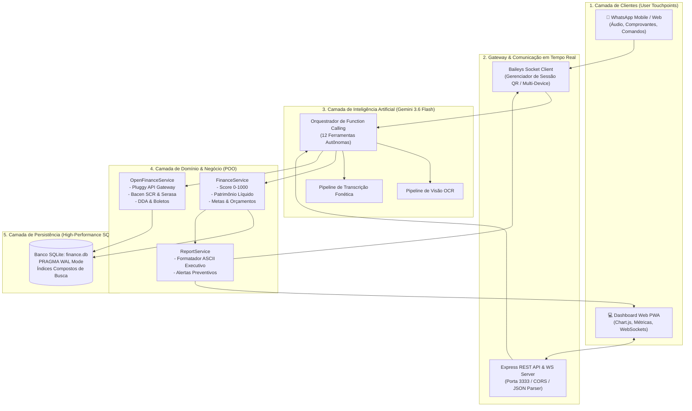

<div align="center">

# 🏦 Open Finance IA
### Assistente Financeiro Autônomo Multimodal no WhatsApp & Dashboard Web Executivo

[](https://www.typescriptlang.org/)
[](https://nodejs.org/)
[](https://ai.google.dev/)
[](https://github.com/WhiskeySockets/Baileys)
[](https://openfinancebrasil.org.br/)
[](https://www.sqlite.org/)
[](https://web.dev/progressive-web-apps/)
[](./LICENSE)

<p align="center">
  <b>Elimine planilhas burocráticas: controle receitas, despesas, cartões, investimentos e dívidas em tempo real conversando por voz ou texto no WhatsApp.</b>
</p>

[Funcionalidades](#-funcionalidades-de-destaque) •
[Arquitetura do Sistema](#-arquitetura-do-sistema) •
[Modelo de Dados](#-modelo-de-dados-er) •
[Clean Code & POO](#-engenharia-de-software--clean-code) •
[Como Executar](#-como-executar-passo-a-passo) •
[API & Endpoints](#-api-rest--endpoints) •
[Atalhos](#-atalhos-rápidos-no-whatsapp)

---

</div>

## 📌 Visão Geral do Projeto

O **Open Finance IA** é uma solução *end-to-end* desenvolvida para transformar o controle financeiro pessoal em uma experiência intuitiva e conversacional. Integrado diretamente ao **WhatsApp** através do protocolo Multi-Device da biblioteca **Baileys**, o sistema conta com o poder cognitivo do **Google Gemini 3.6 Flash** utilizando **Function Calling (Tool Calling)** determinístico para executar operações financeiras com precisão bancária.

Além da interface conversacional móvel, a solução disponibiliza um **Dashboard Web PWA** em tempo real com **WebSockets**, gráficos dinâmicos (Chart.js), integração de agregação bancária (**Pluggy API**) e consolidação de passivos baseados no **SCR do Banco Central (Bacen)** e birôs de crédito (**Serasa**).

---

## ✨ Funcionalidades de Destaque

| Recurso | Descrição | Tecnologia |
|---|---|---|
| 🎙️ **Voz & Áudio Natural** | Envie áudios de voz (*"Gastei R$ 52 no almoço"*). A IA transcreve, categoriza e registra na hora. | Gemini Audio Processing |
| 📷 **Visão Computacional (OCR)** | Tire foto de notas fiscais ou comprovantes Pix; extração automática de valor, local e data. | Gemini Multimodal Vision |
| 📈 **Score Open Finance (0-1000)** | Pontuação de saúde financeira calculada dinamicamente com base em 5 pilares regulatórios. | Algoritmo Bacen Scoring |
| 💎 **Patrimônio Consolidado** | Apuração de ativos líquidos, carteira de investimentos (CDB, Ações, FIIs) e dívidas ativas. | Valuation Engine |
| 🏦 **Agregação Bancária Real** | Conexão segura com Nubank, Itaú, Bradesco, Inter e +80 instituições financeiras. | Pluggy Open Finance API |
| 📄 **Dívidas & Boletos (Bacen/Serasa)** | Rastreamento de empréstimos (SCR) e boletos com assistente de quitação e metas de amortização. | Bacen SCR / DDA Flow |
| 📱 **PWA Instalável** | Painel executivo com tema escuro instalável no celular como aplicativo nativo. | Service Worker & Manifest |

---

## 🗺️ Arquitetura do Sistema

O diagrama abaixo ilustra o fluxo de dados desacoplado e a segregação de responsabilidades do ecossistema:



---

## 🗄️ Modelo de Dados (ER)

O schema do banco foi estruturado em conformidade com as diretrizes relacionais do Open Finance Brasil:

```mermaid
erDiagram
    USERS ||--o{ ACCOUNTS : possui
    USERS ||--o{ TRANSACTIONS : realiza
    USERS ||--o{ BUDGETS : define
    USERS ||--o{ INVESTMENTS : mantem
    USERS ||--o{ FINANCIAL_GOALS : persegue
    USERS ||--o{ DEBTS : responde_por
    USERS ||--o{ CHAT_HISTORY : conversa

    USERS {
        string phone PK "Telefone no padrão E.164"
        string name "Nome do titular da conta"
        datetime created_at "Timestamp de adesão"
    }

    ACCOUNTS {
        int id PK "Auto Increment"
        string user_phone FK "Vínculo ao usuário"
        string institution "Nubank, Itaú, Bradesco, Inter"
        string account_type "checking | savings | credit_card | investment"
        string name "Rótulo descritivo da conta"
        real balance "Saldo disponível em BRL"
        real credit_limit "Limite de crédito atribuído"
        int is_active "Booleano (1 ativo, 0 inativo)"
    }

    TRANSACTIONS {
        int id PK "Identificador único"
        string user_phone FK "Vínculo ao titular"
        string type "income | expense | transfer"
        real amount "Valor monetário da transação"
        string category "Alimentação, Transporte, Moradia, etc."
        string description "Estabelecimento ou detalhe"
        string payment_method "pix | cartao_credito | boleto | dinheiro"
        string date "Data contábil (YYYY-MM-DD)"
        string raw_input "Entrada original capturada"
    }

    BUDGETS {
        int id PK
        string user_phone FK
        string category "Categoria orçada"
        real amount_limit "Teto máximo mensal estipulado"
        string period "Mês de vigência (YYYY-MM)"
    }

    INVESTMENTS {
        int id PK
        string user_phone FK
        string name "Ativo (ex: CDB 120% CDI, Tesouro IPCA)"
        string type "Renda Fixa, Ações, FIIs, Fundos"
        real amount_invested "Custo histórico de aporte"
        real current_value "Marcação a mercado atual"
    }

    DEBTS {
        int id PK
        string user_phone FK
        string name "Identificador da obrigação / Contrato"
        string institution "Bacen SCR / Serasa / Credor"
        real total_amount "Valor total originário"
        real remaining_amount "Saldo devedor em aberto"
        real monthly_payment "Valor da prestação periódica"
        real interest_rate "Taxa de juros pactuada (% a.a.)"
        string due_date "Data de vencimento do título"
        int is_active "1 em aberto, 0 quitado"
    }

    FINANCIAL_GOALS {
        int id PK
        string user_phone FK
        string name "Título do objetivo financeiro"
        real target_amount "Montante final desejado"
        real current_amount "Valor provisionado até o momento"
        string deadline "Data estipulada para conclusão"
        int priority "Nível de criticidade (1 Alta, 2 Média, 3 Baixa)"
    }

    CHAT_HISTORY {
        int id PK
        string user_phone FK
        string role "user ou model"
        string content "Log histórico de contexto"
    }
```



---

## 🏛️ Engenharia de Software & Clean Code

O projeto segue rigorosos padrões de qualidade aplicados na indústria:

### 1. Princípios SOLID Aplicados
- **Single Responsibility Principle (SRP)**:
  - `FinanceService`: Isola os cálculos e regras contábeis puras (Score 0-1000, balanço, taxa de poupança).
  - `OpenFinanceService`: Gerencia a integração com a API da Pluggy e sincronização de contratos de crédito.
  - `ReportService`: Cuida unicamente da renderização visual e formatação de texto dos relatórios.
  - `GeminiService`: Encapsula a invocação e conversão de schemas do SDK de IA.
- **Open/Closed Principle (OCP)**: A lista de ferramentas (`tools`) do Gemini é extensível sem necessidade de refatorar a máquina de inferência.
- **Dependency Inversion (DIP)**: Serviços recebem instâncias de conexão com o banco via injeção em construtor, simplificando testes unitários com bancos em memória.

### 2. Tipagem Estrita e Modelagem de Dados
- Desenvolvido em **TypeScript Strict Mode** (`tsconfig.json` com `noImplicitAny: true`).
- Todas as transferências e DTOs possuem tipagem estrita (`Transaction`, `Debt`, `FinancialScore`, `NetWorth`).

### 3. Otimizações de Banco de Dados
- **WAL Mode (Write-Ahead Logging)** habilitado no SQLite: permite leituras e escritas concorrentes sem travar o processo.
- **Índices Estratégicos**:
  - `idx_tx_phone_date` em `transactions(user_phone, date DESC)` para emissão instantânea de extratos.
  - `idx_goals_phone` em `financial_goals(user_phone, status)` para relatórios de metas.

---

## 📊 Matriz do Score Open Finance (0–1000)

O algoritmo proprietário de pontuação reflete a metodologia de crédito das principais instituições financeiras brasileiras:

| Pilar | Peso | Critério de Avaliação |
|---|:---:|---|
| **Taxa de Poupança** | **25% (250 pts)** | Proporção da renda líquida retida no mês (\( \ge 25\% \) garante pontuação máxima). |
| **Aderência ao Orçamento** | **25% (250 pts)** | Manutenção dos gastos dentro dos tetos estipulados por categoria. |
| **Progresso em Metas** | **20% (200 pts)** | Percentual médio de integralização das metas ativas. |
| **Ratio de Endividamento** | **20% (200 pts)** | Relação entre passivos totais e patrimônio ativo (\( \text{Dívidas} / \text{Ativos} \)). |
| **Consistência de Lançamentos** | **10% (100 pts)** | Regularidade de registros no período para acurácia de análise. |

---

## 🚀 Como Executar Passo a Passo

### Pré-requisitos
- **Node.js** (v18.0 ou superior)
- **npm** (v9.0 ou superior)
- Conta no **Google AI Studio** para obter sua chave de API gratuita do Gemini

### 1. Clonar o Repositório
```bash
git clone https://github.com/twazevedo/finance-bot-whatsapp.git
cd finance-bot-whatsapp
```

### 2. Instalar as Dependências
```bash
npm install
```

### 3. Configurar as Variáveis de Ambiente
Crie seu arquivo `.env` com base no modelo fornecido:
```bash
cp .env.example .env
```

Preencha as chaves:
```env
PORT=3333
NODE_ENV=development
GEMINI_API_KEY=sua_chave_do_google_ai_studio
GEMINI_MODEL=gemini-3.6-flash
DEFAULT_USER_PHONE=5511999999999
PLUGGY_CLIENT_ID=sua_chave_pluggy_opcional
PLUGGY_CLIENT_SECRET=seu_segredo_pluggy_opcional
```

### 4. Executar os Testes Automatizados
```bash
npx tsx src/tests/finance.test.ts
```

### 5. Iniciar a Aplicação
```bash
npm run dev
```

### 6. Parear com o WhatsApp
1. Abra o navegador em `http://localhost:3333`.
2. No seu celular, abra o WhatsApp > **Aparelhos Conectados** > **Conectar um aparelho**.
3. Escaneie o QR Code exibido no terminal ou na interface web.

---

## 🔌 API REST & Endpoints

O servidor Express disponibiliza uma interface RESTful documentada:

| Método | Rota | Descrição |
|---|---|---|
| `GET` | `/api/status` | Retorna o status de conexão com WhatsApp e versão do modelo de IA. |
| `GET` | `/api/summary` | Sumário contábil do mês (receitas, despesas, saldo, poupança). |
| `GET` | `/api/transactions` | Extrato de lançamentos com paginação e filtro por categoria. |
| `GET` | `/api/financial-score` | Score Open Finance (0-1000) e detalhamento dos 5 componentes. |
| `GET` | `/api/net-worth` | Balanço consolidado de patrimônio líquido (ativos vs passivos). |
| `GET` | `/api/goals` | Listagem e evolução de metas de vida ativas. |
| `GET` | `/api/debts` | Dívidas, empréstimos e boletos cadastrados (Bacen SCR / Serasa). |
| `POST` | `/api/debts/pay` | Registra abatimento ou quitação de dívida/boleto. |
| `POST` | `/api/chat` | Simulador de chat com a IA via web. |
| `POST` | `/api/openfinance/connect-token` | Gera token seguro para abertura do widget Pluggy Connect. |
| `POST` | `/api/openfinance/sync` | Aciona a sincronização forçada de transações bancárias. |

---

## 📲 Atalhos Rápidos no WhatsApp

Ao interagir com o bot, você pode digitar o número ou usar linguagem natural:

```text
>> AÇÕES RÁPIDAS <<
1 - Saldo e Resumo do Mês
2 - Extrato Detalhado
3 - Metas & Orçamentos
4 - Score Financeiro (Open Finance)
5 - Patrimônio Líquido
6 - Consultoria Financeira com IA
7 - Desfazer Último Lançamento
8 - Dívidas & Boletos (Bacen / Serasa)
```

---

## 📄 Licença

Distribuído sob a licença **MIT**. Consulte o arquivo [LICENSE](./LICENSE) para obter mais informações.

---

<div align="center">
  <sub>Desenvolvido com foco em alta performance, privacidade local e conformidade com o ecossistema Open Finance Brasil.</sub>
</div>
